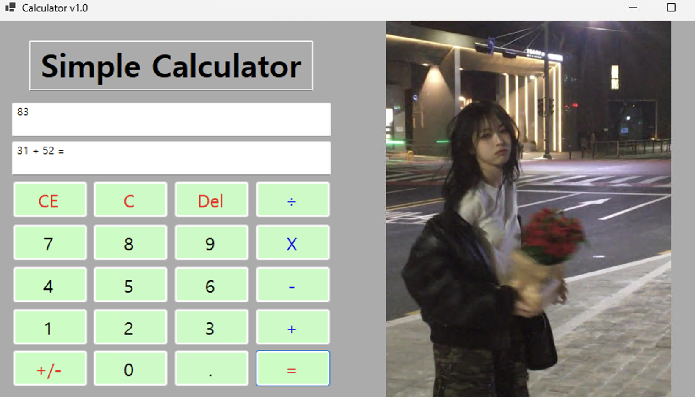
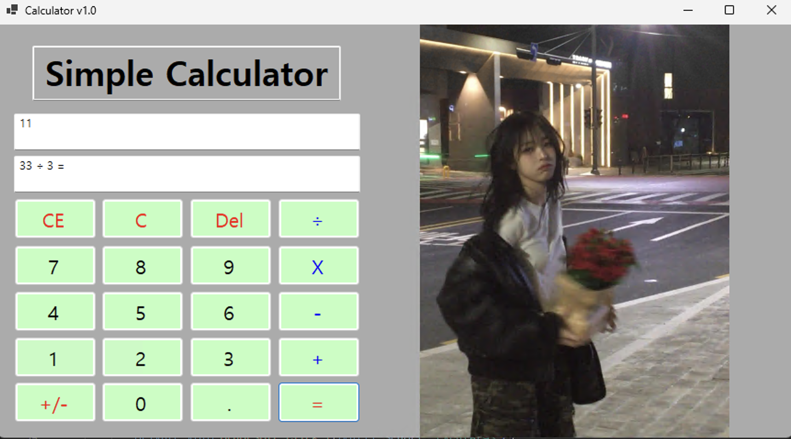
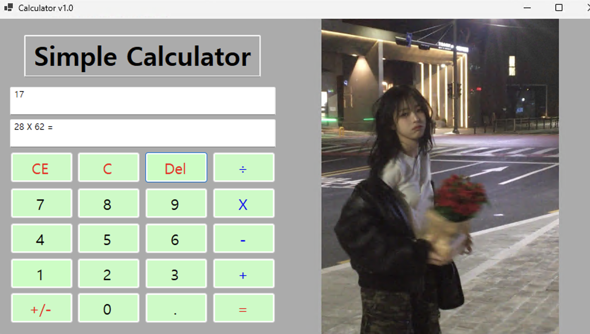

# (C# 코딩) 계산기

## 개요
-C# 프로그래밍학습

-1줄소개: 사용자 키보드입력을 받아서 계산을 해주는 계산기.

-사용한플랫폼: 
    -C#, .NET Windows Forms, Visual Studio, GitHub

-사용한컨트롤:
    - Parse, Button btn = (Button)sender, Label, TextBox, ListBox, Button, PictureBox

-사용한기술과구현한기능: 

## 실행화면(과제1)

-과제1 코드의 실행 스크린샷

-과제 내용
    - textBox(입력 표시, 결과 표시), Button(숫자, 계산) 등을 적절히 배치합니다.
      입력 내용을 2가지 방법(수식 진행 상황, 현재 입력 및 결과)으로 표시하는 기능을 구현합니다.
      계산기의 더하기 연산 기능을 구현합니다.

-구현 내용과 기능 설명
    - num1,2를 만들어서 입력값을 넣을 수 있게끔 하였고, 숫자 1~9까지의 버튼이 눌리면 눌린 버튼의 숫자를 확인해서 txtOutput박스에 추가하게끔 하였습니다.
    
    - 이 상태에서 +를 누르면 Output에 들어간 문자를 숫자로 변환하고, Input에 표시하고 또 다음 숫자를 받기 위해서 Output을 Clear했습니다.
    
    - 다음 2번째 숫자를 입력하면 num2에 저장하고 =을 누르면 (여기서도 2번째 숫자는 Parse로 문자->숫자 변환) num1와num2를 더해서 result에 넣게끔했습니다. 이후 txtInput에 최종 수식을, txtOutput에는 결과를(여기서는 반대로 결과 숫자를 문자로 변환) 표시하게끔 만들었습니다.

## 실행화면(과제2)

-과제2 코드의 실행 스크린샷

-과제 내용
    - 뺄셈(-), 곱셈(*), 나눗셈(/) 버튼을 추가하고 이벤트를 연결합니다.
      각 버튼 클릭 시 연산자만 변경하여 동일한 계산 로직이 적용되도록 사칙연산 계산기를 완성합니다.

-구현 내용과 기능 설명
    - 어떤 연산 기호가 눌렸는지 기억하고 구분하기 위해 문자열 변수 currentOperator를 추가로 선언하였습니다.
    
    - 사칙연산(+, -, *, /) 버튼 4개의 클릭 이벤트를 하나(btnOperator_Click)로 통합하여, 어떤 연산 버튼이 눌리든 해당 버튼의 기호(Text)를 currentOperator에 저장하고 앞서 입력된 값을 num1에 저장하는 공통 로직이 실행되게끔 구현했습니다.

    - 이후 결과(=) 버튼을 누를 때, switch 문을 활용하여 currentOperator에 저장된 기호에 따라 각각 알맞은 사칙연산(더하기, 빼기, 곱하기, 나누기)을 수행하여 result에 넣게끔 로직을 수정했습니다. 이를 통해 코드가 길어지는 것을 방지하고 효율적으로 사칙연산을 완성하였습니다.

## 실행화면(과제3)

-과제3 코드의 실행 스크린샷

-과제 내용
    - 계산기에 있는 수정/삭제 기능(C, CE, Del)을 구현합니다.
      각 버튼의 목적에 맞게 전체 초기화, 현재 입력값 삭제, 마지막 글자 삭제 기능을 완성합니다.

-구현 내용과 기능 설명
    - C (Clear) 버튼: btnC_Click 이벤트를 통해 txtInput과 txtOutput의 텍스트를 모두 비우고(Clear()), 다음 계산에 오류가 생기지 않도록 기존에 기억해둔 변수(num1, num2, result, currentOperator)의 값을 모두 0 또는 빈 문자열("")로 완벽하게 초기화하여 프로그램 실행 초기 상태로 되돌렸습니다.

    - CE (Clear Entry) 버튼: 수식 전체가 아닌 현재 입력 중인 마지막 피연산자만 지우기 위해, btnCE_Click 이벤트에서 txtOutput.Clear()만 단독으로 실행하도록 구현했습니다.

    - Del (Backspace) 버튼: 빈 텍스트박스에서 지우기를 시도할 때 발생하는 오류를 막기 위해 txtOutput.Text.Length > 0일 때만 작동하도록 방어 코드(if문)를 작성했습니다. 이후 Substring 메서드를 사용하여 현재 적힌 문자열의 맨 마지막 글자 하나만 제외하고 잘라내어 다시 저장하는 방식으로, 글자가 하나씩 지워지는 백스페이스 기능을 성공적으로 구현했습니다.

## 실행화면(과제4)

-과제4 코드의 실행 스크린샷

-과제 내용
    -

-구현 내용과 기능 설명
    -